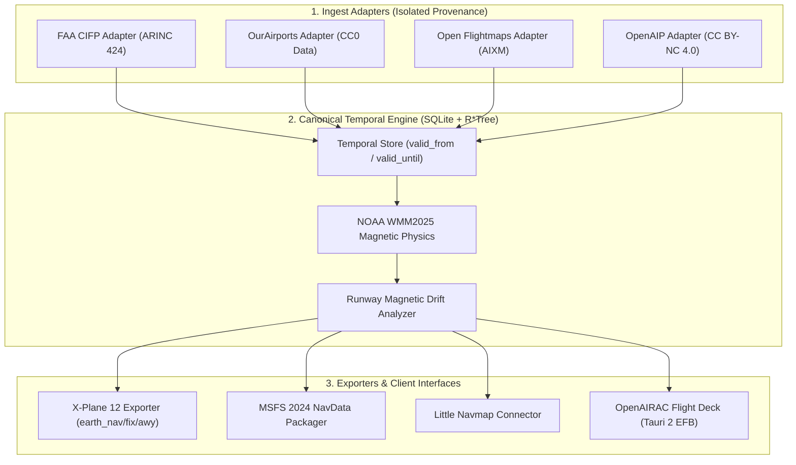

# ✈️ OpenAIRAC

<div align="center">

[](https://opensource.org/licenses/MIT)
[](https://www.rust-lang.org/)
[](https://www.ncei.noaa.gov/products/world-magnetic-model)
[](https://www.x-plane.com/)
[](https://www.flightsimulator.com/)
[](https://github.com/bobberdolle1/open-airac/releases/latest)

**The open navigation data engine for flight simulation. Install once. Stay current automatically.**

[Architecture](docs/ARCHITECTURE.md) • [Data Sources](docs/DATA_SOURCES.md) • [Roadmap](docs/ROADMAP.md) • [Installation](docs/INSTALLATION.md)

</div>

---

## ⚡ The Iron Philosophy

> **"Install once. Navigation updates itself."**

The traditional flight simulation navigation cycle relies on expensive monthly subscriptions and rigid manual 28-day file updates. If you use a database from 2024 in 2026, runway designations drift out of alignment with magnetic headings, radio frequencies expire, and procedures break.

**OpenAIRAC decouples data sources from the runtime engine:**
1. **Canonical Temporal Database:** Maintains a local versioned SQLite navigation store (`world.openairac.sqlite`). Supports querying the navigation world at any historical date ($1980 \dots \text{today}$).
2. **Genuine NOAA WMM2025 Physics:** Uses official NOAA WMM2025 spherical harmonic expansion ($1900 - 2029+$) to calculate true magnetic variation.
3. **Dual Runway Designator Modeling:** Distinguishes between official CAA published designators (`official_designator = "09"`) and magnetic drift candidates (`computed_magnetic_designator = "10"`), alerting users when drift thresholds are exceeded.
4. **Open Data Ingestion Pipelines:** Ingests public domain and open datasets (**FAA CIFP**, **OurAirports**, **Open Flightmaps**, **OpenAIP**) with strict data provenance.

---

## 🏗️ Architecture Overview



---

## 🛠️ Workspace Structure

| Crate | Purpose | Status |
| :--- | :--- | :---: |
| **`magnetic`** | Genuine NOAA WMM2025 spherical harmonic solver & runway magnetic drift analyzer | **Active (P0)** |
| **`nav-model`** | Canonical temporal entities & data provenance structures | **Active (P0)** |
| **`openairac-core`** | Ingest orchestrator & OurAirports parser | **Active (P0)** |
| **`openairac-exporter`** | X-Plane 12 native `.dat` exporter (`earth_nav.dat`, `earth_fix.dat`) | **Active (P0)** |
| **`openairac-cli`** | Command-line tool (`openairac sync`, `magvar`, `magdrift`) | **Active (P0)** |
| **`openairac-plugin`** | Native C-ABI X-Plane 12 background auto-sync plugin (`OpenAIRAC.xpl`) | **Active (P0)** |
| **`openairac-planner`** | Airway graph & route solver engine | *P4 Roadmap* |

---

## 🚀 Quickstart

### Download Ready-to-Use Release (Windows x64)

1. Download **[`OpenAIRAC-v0.1.0-Windows-x64.zip`](https://github.com/bobberdolle1/open-airac/releases/latest)**.
2. For CLI / Auto-Launcher, run:
   ```powershell
   .\openairac-cli.exe sync --sim xp12 --path "F:\SteamLibrary\steamapps\common\X-Plane 12"
   ```
3. For zero-touch in-sim auto-sync, copy `plugins/OpenAIRAC` into:
   ```text
   X-Plane 12 / Resources / plugins / OpenAIRAC / win_x64 / OpenAIRAC.xpl
   ```

### Check Magnetic Declination & Runway Drift via CLI

```powershell
# Compute WMM2025 magnetic declination for Sheremetyevo (UUEE)
openairac magvar --lat 55.9726 --lon 37.4146 --year 2026.0

# Inspect magnetic drift for Runway 09
openairac magdrift --designator "09" --heading 96.7 --lat 55.9726 --lon 37.4146 --year 2026.0
```

---

## 📄 License

Distributed under the **MIT License**. See [`LICENSE`](LICENSE) for details.

<div align="center">
  <sub>Built with ❤️ for the global flight simulation community by <a href="https://github.com/bobberdolle1">bobberdolle1</a>.</sub>
</div>
