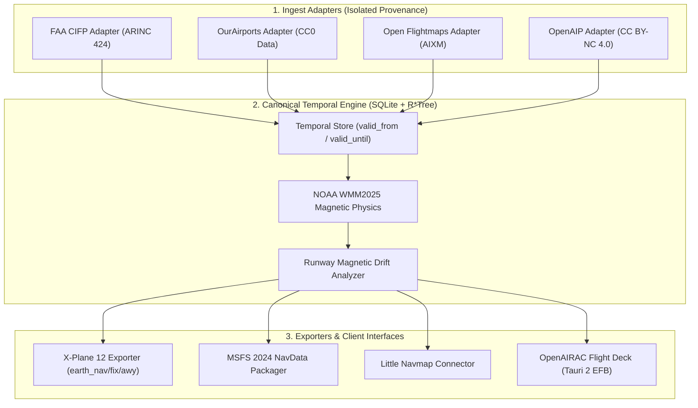

# 🏛️ OpenAIRAC System Architecture

## 1. Executive Summary & Core Philosophy

**"Install once. Navigation updates itself."**

OpenAIRAC is an open-source, canonical aeronautical navigation data engine, WMM dynamic magnetic solver, and flight planning platform for flight simulators (X-Plane 12, MSFS 2024).

Rather than forcing users to manually download and manage 28-day AIRAC cycles, OpenAIRAC decouples data sources from the runtime engine. It maintains a **Canonical Temporal Database** (`world.openairac.sqlite`) with temporal validity ranges (`valid_from`, `valid_until`, `source_provenance`, `revision_id`).

---

## 2. High-Level Data Flow



---

## 3. Key Design Principles

### A. Temporal Database Model (`Source != Database`)
No raw source data (CSV/XML) is consumed directly by exporters or flight planners. All ingest adapters normalize incoming records into canonical temporal entities:

```rust
pub struct TemporalValidity {
    pub valid_from: DateTime<Utc>,
    pub valid_until: Option<DateTime<Utc>>,
    pub revision_id: String,
    pub source: DataSourceProvider,
}
```

This allows querying the world at **any historical date** (e.g. `openairac world --date 2024-08-08`) or using timeline sliders in the flight planner.

---

### B. Magnetic Physics & Official CAA Designator Isolation
Real-world magnetic declination shifts continuously according to NOAA's **World Magnetic Model (WMM2025)**. 
However, physical runway markings and published SID/STAR charts only change when CAA/Airport authorities officially redesignate a runway ($09/27 \to 10/28$).

OpenAIRAC tracks **both** values:
- `official_designator`: Published chart designator (e.g. `"09"`)
- `computed_magnetic_designator`: WMM2025 calculated designator (e.g. `"10"`)

If the magnetic drift exceeds safety thresholds, OpenAIRAC triggers an alert:
```text
⚠️ WARNING: Magnetic drift threshold exceeded! Official: 09, Computed: 10 (Difference: 7.8°)
Awaiting authoritative CAA redesignation.
```

---

## 4. Workspace Architecture

```text
open-airac/
├── crates/
│   ├── nav-model               # Canonical temporal data models
│   ├── nav-store               # SQLite + R*Tree spatial/temporal storage
│   ├── magnetic                # Genuine NOAA WMM2025 spherical harmonics & drift solver
│   ├── openairac-core          # Ingest orchestrator &OurAirports parser
│   ├── openairac-exporter      # X-Plane 12 native .dat & CIFP exporters
│   ├── openairac-planner       # Route solver & airway graph
│   ├── openairac-plugin       # Native C-ABI X-Plane 12 plugin (.xpl)
│   └── openairac-cli          # CLI binary
├── docs/                       # ARCHITECTURE.md, DATA_SOURCES.md, ROADMAP.md
└── .github/                    # CI/CD Workflows
```
